# MessManager v6 🏠

A production-ready mess management web app for shared housing (mess/hostel) in Bangladesh. Handles meals, bazar, rent, utility bills, member settlements, and monthly accounting — all from a single-page web app backed by Supabase.

---

## 🖼️ Screenshots

<table>
  <tr>
    <td width="50%">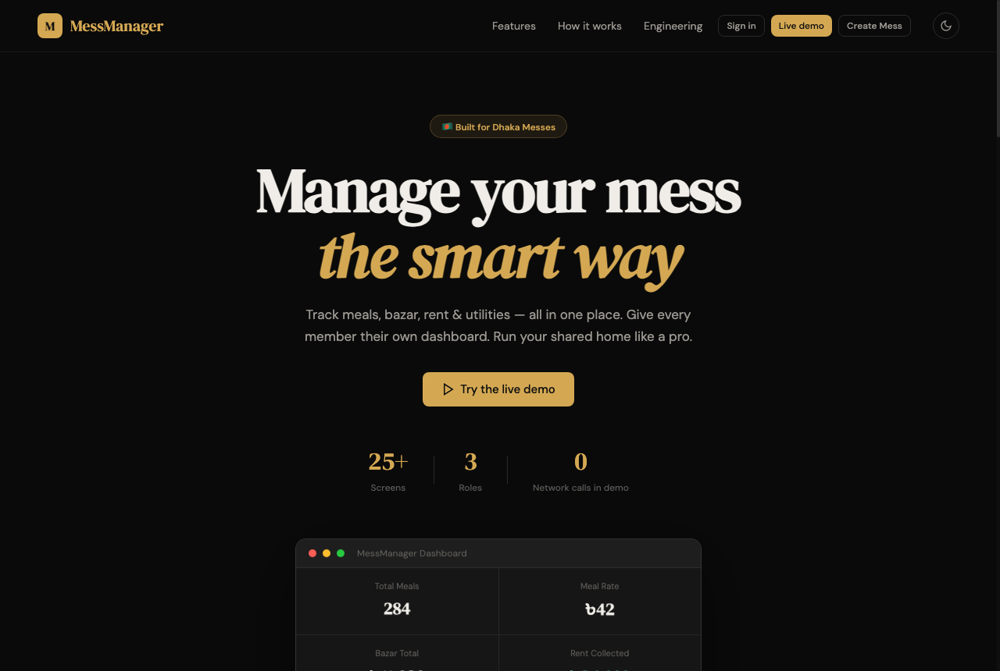<br/><sub><b>Landing</b> — one call to action: the live demo</sub></td>
    <td width="50%">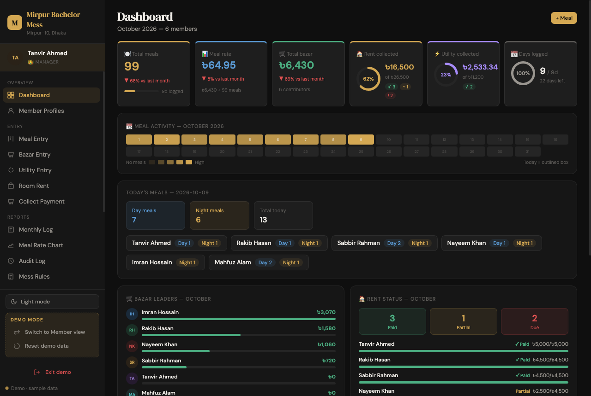<br/><sub><b>Manager dashboard</b> — meal rate, bazar, rent &amp; utility collection, activity heat-map</sub></td>
  </tr>
  <tr>
    <td>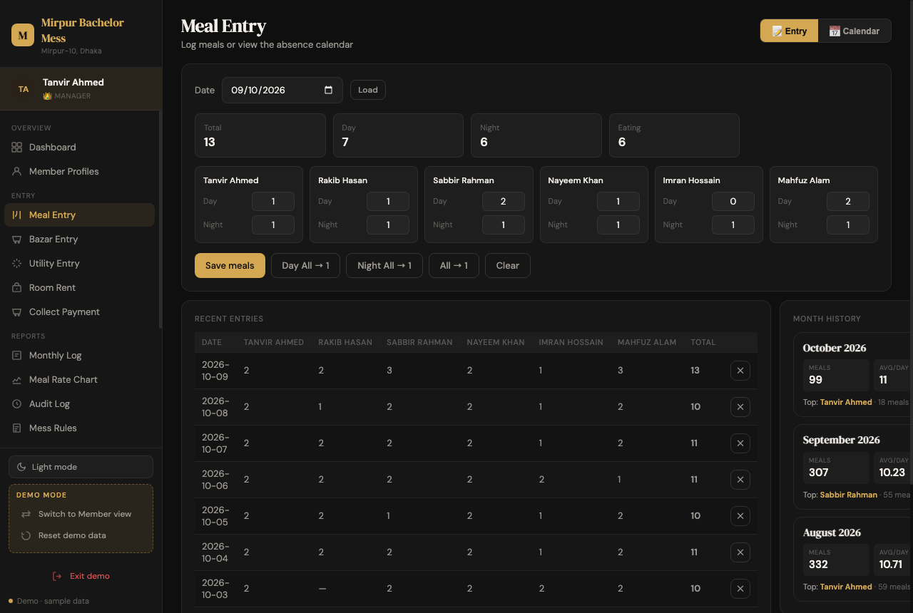<br/><sub><b>Meal entry</b> — day/night meals per member, on/off absences</sub></td>
    <td>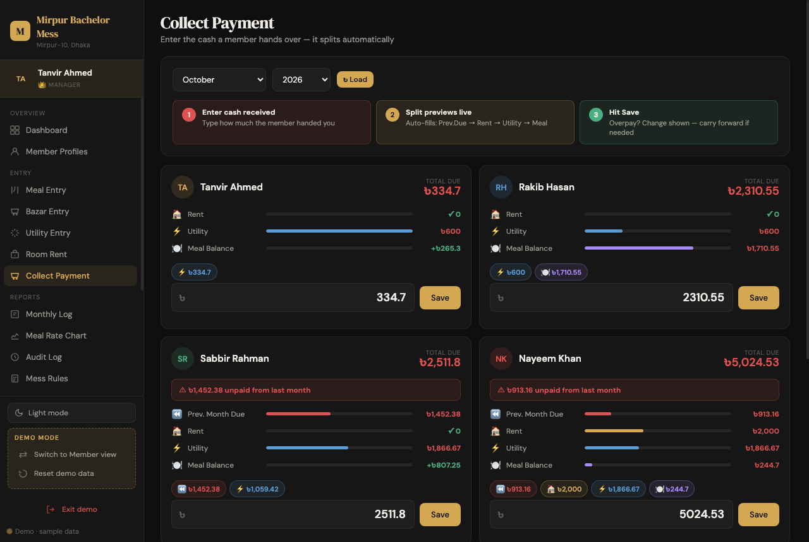<br/><sub><b>Collect payment</b> — cash is split automatically: previous due → rent → utility → meal</sub></td>
  </tr>
  <tr>
    <td>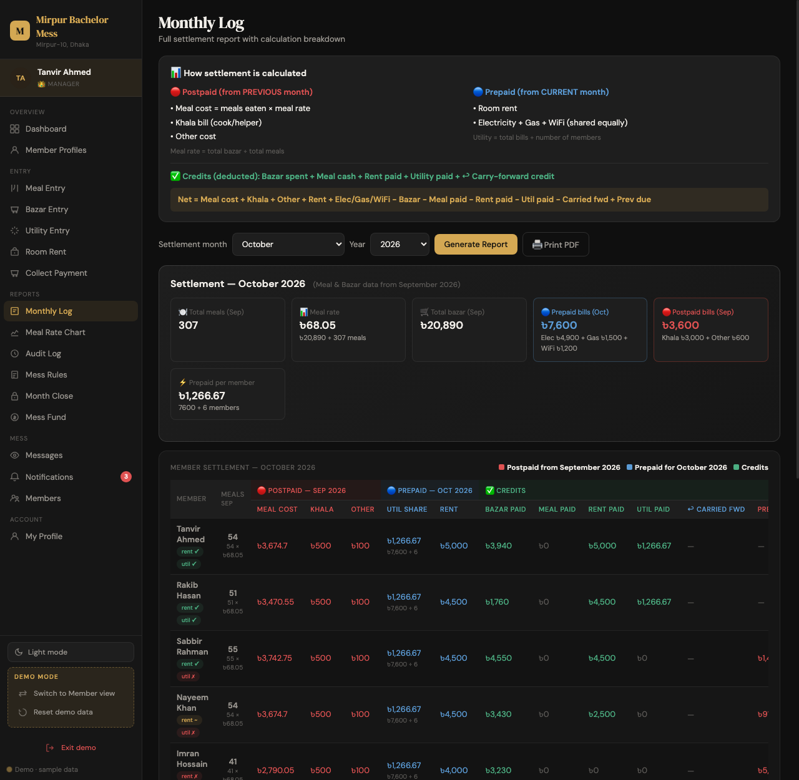<br/><sub><b>Monthly settlement</b> — prepaid vs. postpaid, credits, carried-forward dues</sub></td>
    <td>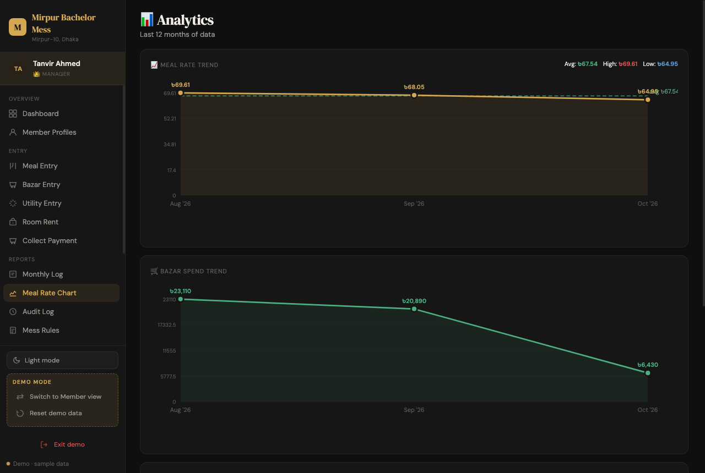<br/><sub><b>Meal-rate chart</b> — trend across months</sub></td>
  </tr>
  <tr>
    <td align="center">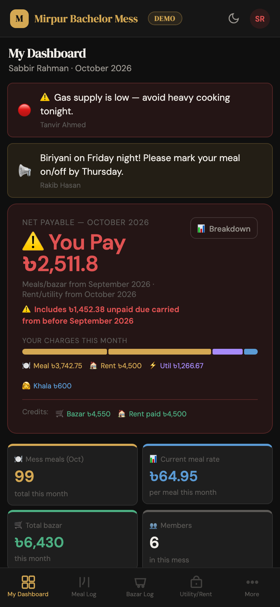<br/><sub><b>Member view (mobile)</b> — what I owe, announcements, bottom navigation</sub></td>
    <td>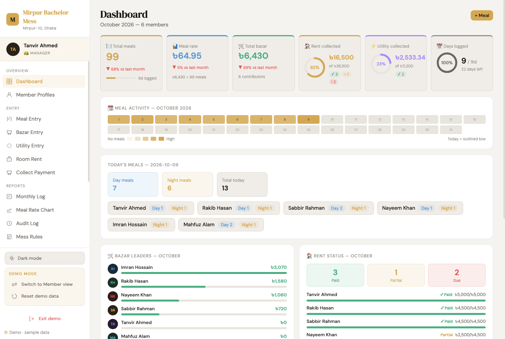<br/><sub><b>Light mode</b> — themes via CSS variables</sub></td>
  </tr>
</table>

> Screenshots are taken from the built-in sandbox demo (fictional data).

---

## 🎯 One site, two separate worlds

| | **Real app** (Supabase) | **Sandbox demo** (in-memory) |
|---|---|---|
| Sign in | `#/login` | `#/demo/login` — or one click: `#/demo` |
| Create a mess | `#/create` — a real mess | `#/demo/create` — a sandbox mess |
| The app | `#/app/<page>` | `#/demo/app/<page>` |
| Database | yes | **never** |
| Session | `localStorage`, 30 days | `sessionStorage`, until the tab closes |
| Landing | `#/` | `#/demo` → straight into the sample mess |

The two worlds share the page code but nothing else: separate URL namespaces, separate sessions, separate backend clients. A sandbox session can't open `#/app/…`, a real session can't open `#/demo/app/…`, and signing out of one leaves the other untouched.

The sandbox is an in-memory, PostgREST-style client (`js/demo/`) seeded with a fictional Dhaka mess (three months of meals, bazar, rent, bills, announcements, requests, audit log). It behaves like the real app end to end: create a sandbox mess → you're its manager → add members (PBKDF2-hashed passwords) → **Switch to Member view** (or sign out and sign in as them at `#/demo/login`; the sample accounts are `demo_manager` / `demo_member`, password `Demo@1234`). A refresh keeps the sandbox data, closing the tab discards it, and **Reset demo data** returns to the sample mess.

Feature flags live in `js/core/env.js`:

| Flag | Default | Meaning |
|---|---|---|
| `liveLogin` | `true` | Real sign-in works. `false` = sandbox-only site; also drop the Supabase origin from the CSP `connect-src` (in `index.html`, `_headers`, `vercel.json`) |
| `liveSignup` | `true` | `#/create` makes a REAL mess. `false` = `#/create` redirects to the sandbox (`#/demo/create`) so a public link can't create real accounts |

Run it locally with any static server, e.g. `python3 -m http.server` → http://localhost:8000.

### Routes

Hash-based, so it works on any static host without rewrite rules:

| Route | Notes |
|---|---|
| `#/` · `#/features` · `#/how-it-works` · `#/engineering` | Landing page (+ scroll to section) |
| `#/login` · `#/create` · `#/app/<page>` · `#/admin/<page>` | Real world. App pages need a session, are guarded by role, remember where you were heading, and support back/forward |
| `#/demo` · `#/demo/login` · `#/demo/create` · `#/demo/app/<page>` | Sandbox world (same guards, own session). `#/demo` opens the sample mess as its manager; switch to a member's view from the sidebar. A deep link like `#/demo/app/meals` auto-starts the demo |

### Security posture

- **Strict CSP** (`script-src 'self'`, no `unsafe-inline`/`eval` for scripts, no third-party origins; `connect-src` allows only your Supabase project). Legacy inline `onclick="…"` attributes are moved to `data-on-*` on insertion and run by a tiny whitelist interpreter (`js/core/events.js`) — it understands a fixed grammar and dispatches to existing functions, never `eval`.
- Real response headers in `_headers` (Netlify/Cloudflare) and `vercel.json`: HSTS, `frame-ancestors 'none'`, `nosniff`, `Referrer-Policy: no-referrer`, `Permissions-Policy`, COOP/CORP.
- User-controlled strings are escaped before reaching `innerHTML`; PBKDF2-SHA-256 password hashing; login lockout; demo session in `sessionStorage` only; all storage access guarded for private-mode browsers.
- Self-hosted fonts and a vendored Supabase SDK — no CDN dependencies.

### Performance

The landing page needs ~32 KB of gzipped JS (11 small deferred scripts) plus ~13 KB CSS. Page modules (~110 KB gz), the demo backend and the Supabase SDK are fetched on demand per role, and prefetched while the landing page is idle. Fonts are self-hosted, preloaded, `font-display: swap`. Below-the-fold sections use `content-visibility: auto`.

### Smoke test

`tests/smoke.html` drives the real app in an iframe (guards, every page for both roles, interactions, CSP violations, mock-store mutations). Serve the repo and open `/tests/smoke.html`; it prints PASS/FAIL lines.

---

## 🧱 System design

### 1. Architecture

A static, build-free single-page app. The same page modules run against **one of two backends**, chosen by the URL namespace: Supabase for the real app, or an in-memory client for the sandbox demo.

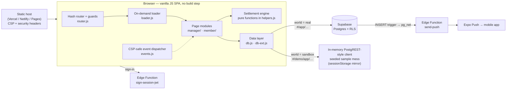

**Key idea:** every page talks to the database through `getClient().from(table)…`. Swapping that one function between the Supabase SDK and `js/demo/mock-client.js` is what lets the *unchanged* app code power the sandbox, so the demo can never drift from the real product.

### 2. Routing &amp; access control

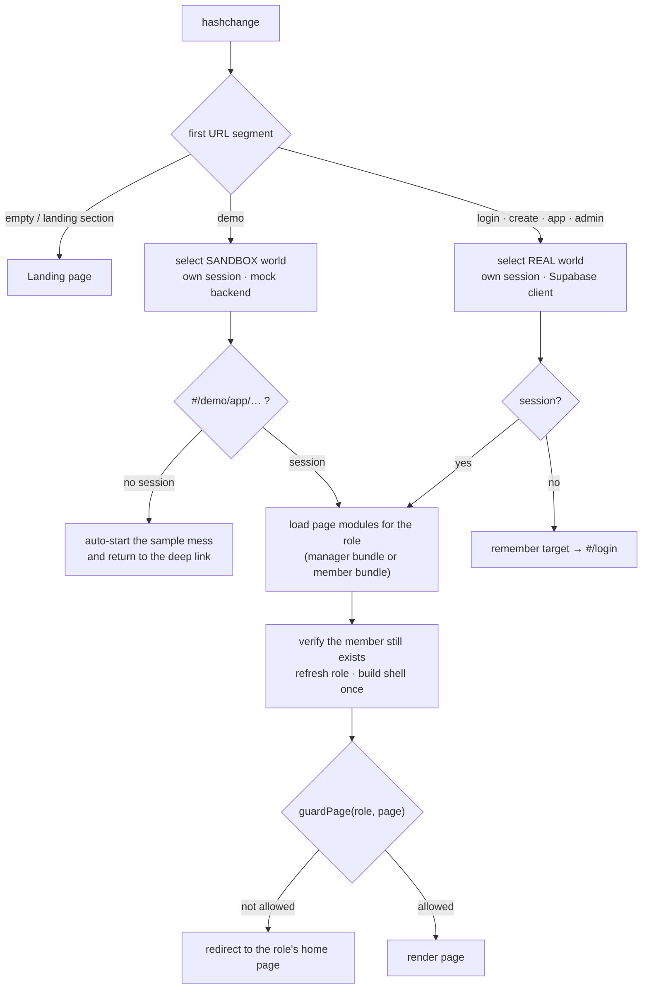

The two worlds share page code but nothing else: separate URL namespaces, session storage (`localStorage` vs `sessionStorage`), backend clients and sign-out behaviour.

### 3. Sign-in &amp; data access (real world)

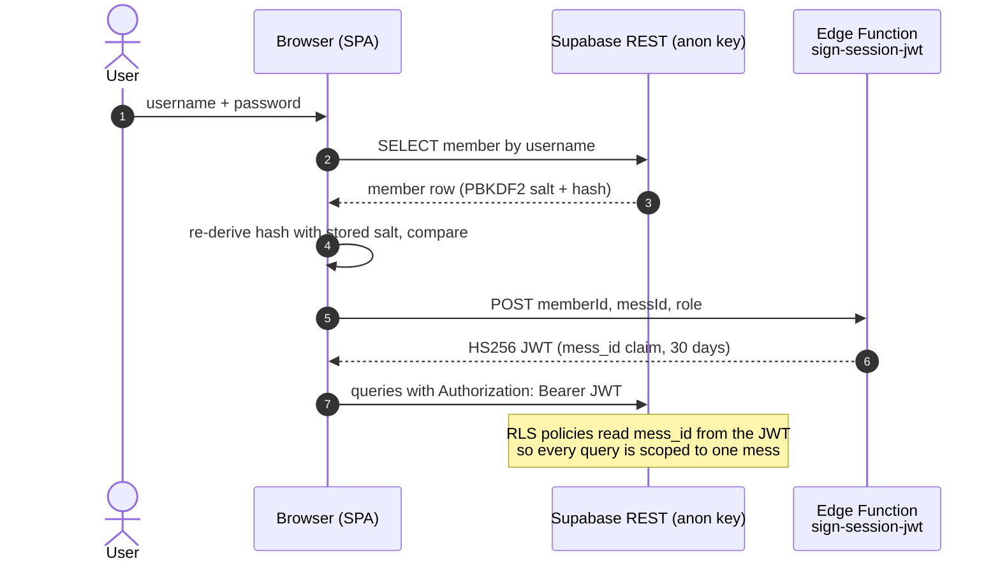

### 4. Monthly settlement (domain core)

All screens (dashboard, profiles, collect-payment, monthly log, member view) call the same pure functions — `calcSettlementTotals`, `calcMemberSettlement`, `calcPrevDueForMember` — so numbers can't disagree between pages.

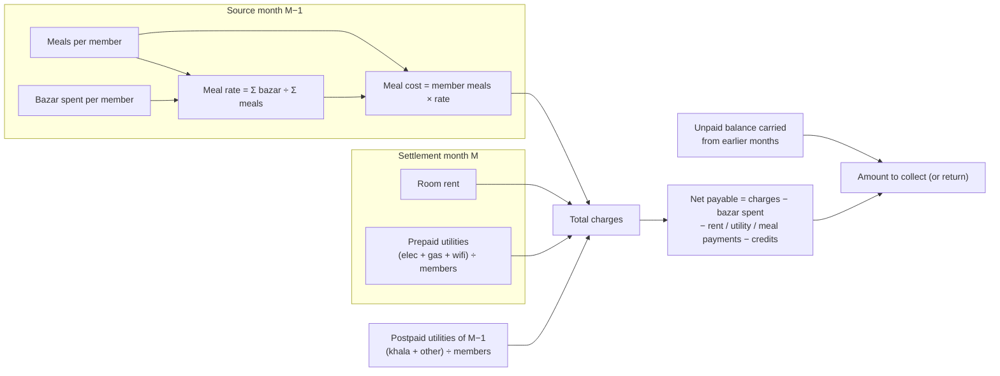

### 5. Data model

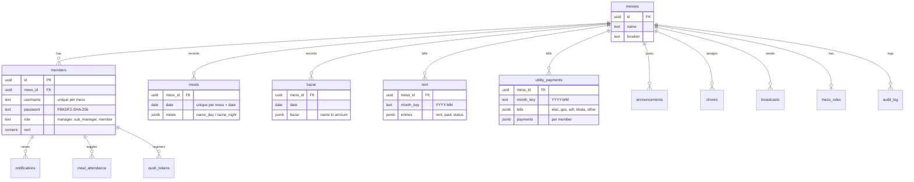

Monthly records are JSONB documents keyed by `(mess_id, month_key)` / `(mess_id, date)`: one round-trip loads a whole month, and the settlement engine can run client-side without joins.

### 6. Push notifications

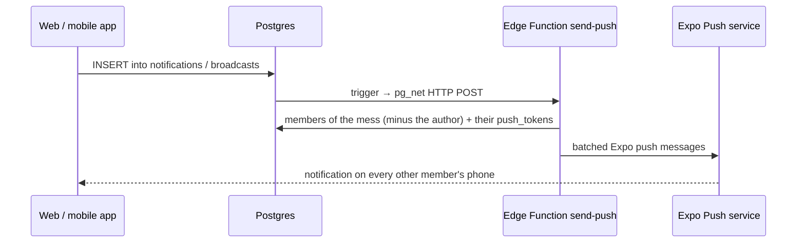

### 7. Sandbox demo internals

| Piece | How it works |
|---|---|
| `js/demo/mock-client.js` | Implements the slice of the PostgREST builder the app uses: `select / insert / update / upsert / delete`, `eq neq gt gte lt lte in`, `order range limit`, `single / maybeSingle`, `count + head`, the `messes(*)` embed, unique constraints and cascade deletes |
| `js/demo/seed.js` | Deterministic seeded generator (PRNG), dates relative to *today* so data always looks current: 6 members, ~3 months of meals/bazar, rent, bills, payments, mess-fund log, announcements, requests, audit trail |
| Persistence | Debounced mirror to `sessionStorage`: refresh keeps your sandbox, closing the tab discards it |
| Isolation | URL namespace `#/demo/…`, separate session key, `connect-src` never used by the sandbox |
| Tests | `tests/smoke.html` drives the real app in an iframe: guards, every page for both roles, mutations, CSP violations, create-mess → add-member → member-view journey, world isolation |

### 8. Design decisions &amp; trade-offs

| Decision | Why | Trade-off |
|---|---|---|
| Vanilla JS, no framework or build step | Zero toolchain, deploys anywhere, tiny first load | No component model; HTML is built with template strings (all dynamic values are escaped) |
| Hash routing | Works on any static host and from `file://` without rewrite rules | URLs contain `#/` |
| Lazy script groups instead of a bundler | Landing needs ~32 KB gzipped JS; page modules load per role | More requests than one bundle (HTTP/2 + prefetch hide it) |
| Strict CSP + whitelist event dispatcher | Blocks injected inline script without rewriting ~200 legacy `onclick` attributes | A small interpreter to maintain; long-term goal is `addEventListener` |
| JSONB month documents | One query per month; settlement logic stays in testable client functions | No relational constraints inside the JSON |
| Mock client mirrors PostgREST | One code path for real and sandbox | Mock must be kept in step with any new query operators the app starts to use |

### 9. Known limitations &amp; roadmap

- **Move credential verification server-side.** Today the browser compares the password hash and then asks `sign-session-jwt` for a token; the function should verify credentials itself (service role) or the app should adopt Supabase Auth.
- **Tighten RLS.** Apply `supabase/rls-policies.sql` everywhere and remove the permissive `allow_anon_all` policies from the bootstrap schema.
- **Unit tests for the settlement functions** (they are pure, so they are easy to cover); the browser smoke test currently covers behaviour end to end.
- **Optional build step** (minify + content-hashed filenames) for immutable caching of JS/CSS.
- **Replace inline handler attributes** with `addEventListener` and drop the dispatcher.

---

## 📋 Table of Contents

- [Screenshots](#️-screenshots)
- [One site, two worlds](#-one-site-two-separate-worlds)
- [System design](#-system-design)
- [Quick Setup](#-quick-setup)
- [File Structure](#-file-structure)
- [User Roles](#-user-roles)
- [Features](#-features)
- [Settlement Model](#-settlement-model)
- [Navigation & Routing](#-navigation--routing)
- [Database Schema](#-database-schema)
- [Security (Path C)](#-security-path-c)
- [Mobile Support](#-mobile-support)
- [Customization](#-customization)

---

## 🚀 Quick Setup

### Step 1 — Supabase project

1. Go to [supabase.com](https://supabase.com) and create a free project
2. Open **SQL Editor** → paste and run `database.sql`
3. For v7 features (attendance, broadcasts, mess rules, audit log) also run `supabase/migration-v7-features.sql`
   — and `supabase/member-payments.sql` for **Give Payment** (member payment requests the manager confirms; the mobile app shares this table, so skip it if you already ran it)
4. Go to **Project Settings → API** and copy your **Project URL** and **Anon/Public key**

### Step 2 — Configure

Open `js/core/config.js` and update:

```js
const SUPABASE_URL = "https://your-project.supabase.co";
const SUPABASE_KEY = "your-anon-public-key";
```

### Step 3 — Deploy

Pure static site — no build step needed. Upload the folder to any static host:

| Host | Method |
|---|---|
| **Netlify** | Drag & drop folder at netlify.com/drop |
| **Vercel** | `vercel deploy` |
| **GitHub Pages** | Push repo → enable Pages on `main` |
| **Any FTP host** | Upload all files as-is |

---

## 📁 File Structure

```
MessManager-v6/
├── index.html                          # Single-page app shell + all script tags
├── database.sql                        # Run once in Supabase SQL Editor
│
├── css/
│   ├── 01-variables.css                # Design tokens, colours, dark mode vars
│   ├── 02-landing.css                  # Landing & auth screen styles
│   ├── 03-auth.css                     # Login / create-mess form styles
│   ├── 04-layout.css                   # Sidebar, topbar, shell layout
│   ├── 05-components.css               # Cards, tables, modals, badges, forms
│   └── 06-animations-responsive.css    # Transitions + mobile breakpoints
│
├── js/
│   ├── core/
│   │   ├── config.js       # Supabase client, getClient(), _getSessionToken(), password hashing
│   │   ├── db.js           # dbGetAll, dbGetMonth, dbUpsertMeals, dbUpsertBazar, dbDeleteMember…
│   │   ├── db-ext.js       # Audit log, meal attendance, broadcasts, mess rules DB functions
│   │   ├── helpers.js      # calcMemberSettlement, fmtTk, round2, saveSession, loadSession…
│   │   ├── auth.js         # Login, create-mess, superadmin panel, signSessionJWT, bootApp
│   │   └── nav.js          # Page routing, sidebar builder, mobile nav, renderPage switch
│   │
│   ├── manager/
│   │   ├── dashboard.js    # Mess overview: stat cards, ring charts, heatmap, today's meals
│   │   ├── profiles.js     # Member profile popups: full stats, settlement, recent months
│   │   ├── meals.js        # Daily meal entry (day/night split), meal calendar view
│   │   ├── bazar.js        # Daily bazar entry per member
│   │   ├── utility.js      # Monthly utility bills (elec, gas, wifi, khala, other)
│   │   ├── collect.js      # Collect payment from member + print payment receipt
│   │   ├── payment-requests.js # Confirm / reject members' Give Payment requests (inside Collect)
│   │   ├── log.js          # Monthly settlement report + print PDF layout
│   │   ├── announcements.js # Post, pin, delete mess-wide notices
│   │   ├── notifications.js # Approve/reject member requests (meal, bazar, bill)
│   │   ├── members.js      # Add, edit, remove members; password reset
│   │   ├── features.js     # Absence calendar, broadcasts, mess rules editor, meal rate chart
│   │   ├── audit.js        # Audit log viewer with entity filter and pagination
│   │   └── roles.js        # Promote/demote sub-managers
│   │
│   └── member/
│       ├── dashboard.js    # Personal dashboard: net payable, heatmap, broadcasts, mess snapshot
│       ├── pages.js        # Meal log (with absence range picker), bazar log, payments, profile
│       └── give-payment.js # Give Payment: member sends a payment request; shared receipt builders
│
└── supabase/
    ├── migration-v7-features.sql           # New tables: audit_log, meal_attendance, mess_rules, broadcasts
    ├── member-payments.sql                 # member_payments table for Give Payment requests
    ├── rls-policies.sql                    # Row Level Security policies (optional — see Security section)
    └── functions/
        └── sign-session-jwt/
            └── index.ts                   # Edge Function: signs mess-scoped JWT for RLS
```

---

## 👤 User Roles

### 👑 Manager
- Created automatically when a new mess is created
- Full access to all entry pages, reports, member management, and settings
- Can promote members to **Sub-manager**
- Can transfer the manager role to any other member at any time

### ⚡ Sub-manager
- Promoted by the manager from the **Manager Roles** page
- Can enter meals, bazar, utility, and rent; post announcements; collect payments
- Cannot add/remove members, change passwords, promote others, or transfer role

### 👤 Member
- Added by the manager with a unique username and password
- Personal dashboard showing their own net payable, meal activity, and mess snapshot
- Can submit meal/bazar/bill requests (pending manager approval)
- Can mark absence ranges in the Meal Log section
- Can view announcements, chore roster, and mess info

---

## 🗂️ Features

### Manager pages

| Page | Description |
|---|---|
| **Dashboard** | Stat cards with ring charts, meal activity heatmap, today's meals, bazar leaders, rent status, member meal comparison |
| **Member Profiles** | Per-member popup: full stats, settlement breakdown, recent months table, What I Owe section |
| **Meal Entry** | Enter day/night meals per member per date; view monthly calendar |
| **Bazar Entry** | Enter grocery amounts per member per date |
| **Utility Entry** | Enter monthly bills: electricity, gas, WiFi, khala, other; manage per-member payments |
| **Room Rent** | Set and track rent per member; mark paid/partial/unpaid |
| **Collect Payment** | Receive cash from a member, auto-allocate to meal/rent/utility, print receipt |
| **Absence Calendar** | Full-month calendar showing which members are absent each day (from both meal entries and explicit toggles) |
| **Monthly Log** | Full settlement report with all columns; print PDF layout |
| **Meal Rate Chart** | Bar chart of per-meal cost over all months with average line |
| **Audit Log** | Every data change logged with actor, timestamp, and summary; filterable by entity |
| **Announcements** | Post and manage mess-wide notices |
| **Broadcasts** | Send urgent banners that appear on every member's dashboard |
| **Mess Rules** | Set WiFi password, bank/payment info, rules text, emergency contacts |
| **Chore Roster** | Assign and track cleaning duties |
| **Notifications** | Review and approve/reject member requests |
| **Members** | Add, edit, remove members; reset passwords |
| **Manager Roles** | Promote/demote sub-managers with permission table |
| **Transfer Role** | Hand off manager role to another member |

### Member pages

| Page | Description |
|---|---|
| **My Dashboard** | Net payable hero card, broadcast banners, mess-wide stat cards, my meal heatmap, today's meals with personal status, who-ate-how-much chart, bazar leaderboard |
| **Meal Log** | Absence range picker (mark absent for a date range in one click), upcoming absences list, meal entry form, month history |
| **Bazar Log** | Personal bazar history |
| **Utility/Rent** | Submit bill payments; view payment status |
| **Mess Overview** | Mess-wide meal and bazar summary |
| **Announcements** | Read mess notices |
| **Chore Roster** | View assigned duties |
| **Mess Info** | Read WiFi password, payment info, rules, and contacts set by the manager |
| **My Profile** | Personal stats, settlement breakdown, recent months |

---

## 💰 Settlement Model

Settlement is calculated monthly. Each settlement month uses data from **two different months**:

### 🔴 Postpaid — from the **previous** month

These are settled at month end because the amounts are only known after the month closes:

| Item | Formula |
|---|---|
| **Meal cost** | meals eaten × (total bazar ÷ total meals) |
| **Khala salary share** | khala bill ÷ number of members |
| **Other charges share** | other bill ÷ number of members |

### 🔵 Prepaid — from the **current** month

These are fixed amounts known at the start of the month:

| Item | Formula |
|---|---|
| **Room rent** | fixed amount per member |
| **Utility share** | (electricity + gas + WiFi) ÷ number of members |

### ✅ Credits (deducted)

| Credit | Source |
|---|---|
| **Bazar contributed** | grocery amounts the member bought |
| **Rent paid** | amount marked paid in rent collection |
| **Utility paid** | amount paid in utility collection |
| **Meal cash paid** | direct cash payment for meal balance |
| **↩ Carried forward** | overpayment or mess-owes credit from previous month |

### Net formula

```
Net = Meal cost + Khala + Other + Rent + Utility
    − Bazar − Rent paid − Utility paid − Meal paid − Carried fwd

Positive → member owes the mess
Negative → mess owes the member
```

---

## 🧭 Navigation & Routing

Route-based via `js/core/router.js` (see **Routes** above). `navigate(page)` now changes the URL to `#/app/<page>` (or `#/demo/app/<page>` in the sandbox); the router runs the guards, loads the page modules for the role, and calls `showPage()` in `nav.js`.

**Access control:**

- `manager` role → sees full manager nav; blocked from member-only pages
- `sub_manager` role → sees manager nav minus: Members, Transfer Role, Manager Roles
- `member` role → sees member nav only; redirected away from any manager page
- `superadmin` → live builds only; separate admin panel (all messes, metrics)

The route guards are a UX layer. In live mode real enforcement is Supabase RLS (see Security below).

**Mobile nav** shows the 5 most-used pages as bottom tabs. All other pages are reachable via the **More** drawer.

---

## 🗄️ Database Schema

### Core tables (from `database.sql`)

| Table | Purpose |
|---|---|
| `messes` | One row per mess — `name`, `location`, `created_at` |
| `members` | All users — `name`, `username`, `password` (PBKDF2 hash), `role`, `room`, `rent`, `phone`, `joined` |
| `meals` | Daily meal log — `date`, `meals` (JSONB: `{ "Name_day": 1, "Name_night": 1 }`) |
| `bazar` | Daily grocery log — `date`, `bazar` (JSONB: `{ "Name": 250 }`) |
| `rent` | Monthly rent — `month_key`, `entries` (JSONB array with paid/status per member) |
| `utility_payments` | Monthly bills — `month_key`, `bills` (JSONB), `payments` (JSONB per member) |
| `announcements` | Mess notices — `title`, `body`, `pinned`, `author` |
| `chores` | Chore assignments — `week_label`, `assignments` (JSONB) |
| `notifications` | Member requests — `type`, `payload`, `status` (pending/approved/rejected) |

### v7 tables (from `supabase/migration-v7-features.sql`)

| Table | Purpose |
|---|---|
| `audit_log` | Every data change — `actor_name`, `action`, `entity`, `summary`, `details` (JSONB) |
| `meal_attendance` | Member absence records — `member_id`, `date`, `day_meal`, `night_meal` |
| `mess_rules` | Pinned info — `wifi_pass`, `bank_info`, `rules_text`, `contacts` |
| `broadcasts` | Urgent banners — `message`, `priority`, `author`, `expires_at` |

### Give Payment table (from `supabase/member-payments.sql`)

| Table | Purpose |
|---|---|
| `member_payments` | A member's payment request — `member_id`, `month_key`, `amount`, `status` (pending/confirmed/rejected), `split` (JSONB), `still_due`, `receipt_no`, `confirmed_by` |

---

## 🛡️ Security (Path C)

The app ships with a client-side auth system (PBKDF2 password hashing). Optional **Row Level Security** can be enabled in three steps:

### Step 1 — Deploy the Edge Function

```bash
supabase functions deploy sign-session-jwt
```

Then in Supabase Dashboard → Edge Functions → **sign-session-jwt** → Secrets, add:

```
SESSION_JWT_SECRET = <64-char random hex>
```

Generate one with:
```bash
openssl rand -hex 32
```

### Step 2 — Tell Supabase to trust your JWT

Supabase Dashboard → **Settings → API → JWT Secret** → paste the same secret.

### Step 3 — Run RLS policies

In SQL Editor, run `supabase/rls-policies.sql`. This enables RLS on all tables and adds policies so each mess can only read its own data.

### How it works

```
Login → Edge Function signs JWT with { mess_id, member_id, role }
      → JWT stored in localStorage alongside session
      → All DB calls use getClient() which sends Authorization: Bearer <jwt>
      → Supabase RLS reads mess_id from JWT → blocks cross-mess queries
```

**Without Path C:** The app works normally using the anon key. `getClient()` falls back to `sb` (the anon client) when no JWT is present — zero impact on functionality.

---

## 📱 Mobile Support

- Responsive layout with sidebar hidden on mobile
- Bottom navigation bar with 5 primary tabs + More drawer
- All modals, tables, and cards adapt to narrow screens
- Profile popup, settlement sections, and report tables are horizontally scrollable
- Absence calendar, meal heatmap, and chart all have mobile-optimised sizing

---

## 🎨 Customization

### Change the currency symbol
In `js/core/helpers.js`:
```js
const fmtTk = (n) => "৳" + fmt(n);
// Change "৳" to any symbol
```

### Change avatar colours
In `js/core/config.js`, edit the `PALETTE` array (background/foreground colour pairs).

### Add a utility bill type
1. Add the key to `UTIL_PREPAID_KEYS` or the relevant array in `helpers.js`
2. Add its label to the label maps in `utility.js`

### Change superadmin credentials
In `js/core/config.js`, find the `SUPERADMIN` object and update `username` and `passwordHash`.

> ⚠️ Always use a strong random password and never use the default in production.

### Branding
In `index.html`, find all instances of the `M` monogram inside `.land-logo-icon` elements and replace with your own letter or SVG.

---

## 📊 Print / PDF

### Payment Receipt (Collect Payment page)
- Click **🖨 Print** after collecting a payment
- Opens a clean A5 receipt layout in the browser print dialog
- Shows: member name, amount received, allocation breakdown, remaining balances, change to return

### Monthly Settlement Print (Monthly Log page)
- Select a month → **Generate Report** → **🖨️ Print PDF**
- Page 1 (landscape): full settlement table matching the on-screen layout — stat cards, colour-coded columns (Postpaid/Prepaid/Credits), totals row
- Page 2+: one receipt card per member showing full charges, credits, and net amount

---

## 🔧 Tech Stack

| Layer | Technology |
|---|---|
| Frontend | Vanilla HTML + CSS + JavaScript (no framework) |
| Backend | [Supabase](https://supabase.com) (PostgreSQL + Auth + Edge Functions) |
| Auth | Custom PBKDF2-SHA256 password hashing in browser |
| Hosting | Any static host (Netlify, Vercel, GitHub Pages, FTP) |
| PDF/Print | Browser native `window.print()` with iframe injection |
| Charts | Pure SVG (no chart library) |

---

Built with ❤️ · MessManager v6 · 2026
